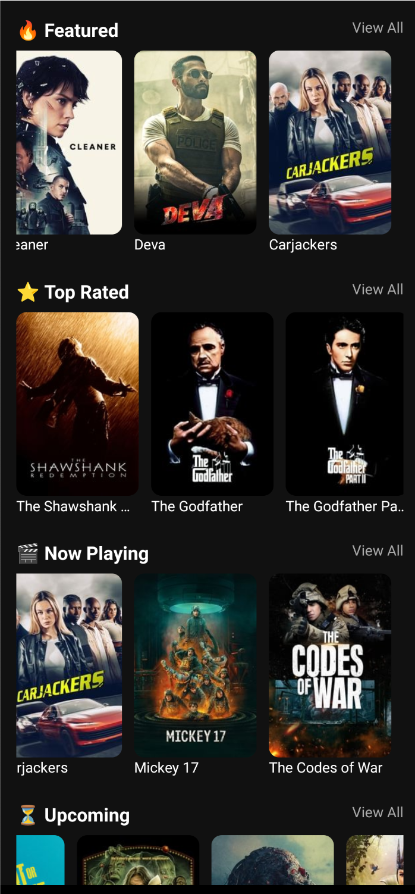
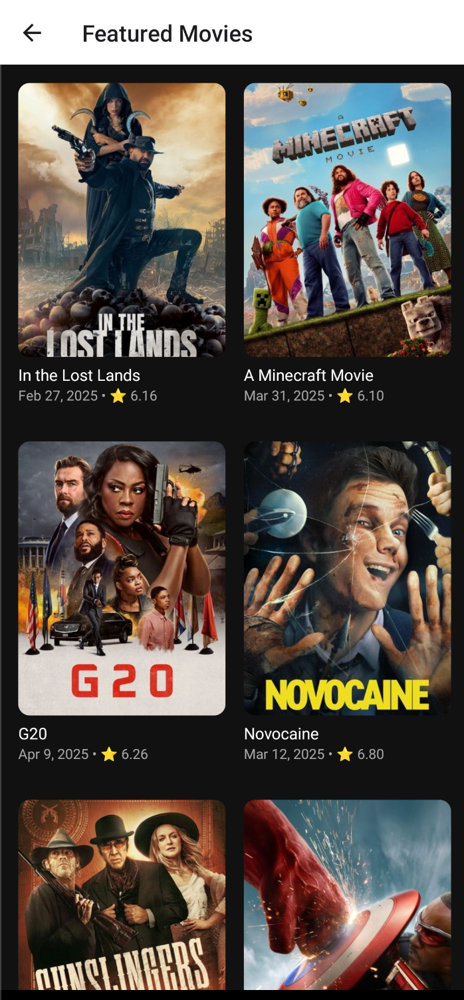
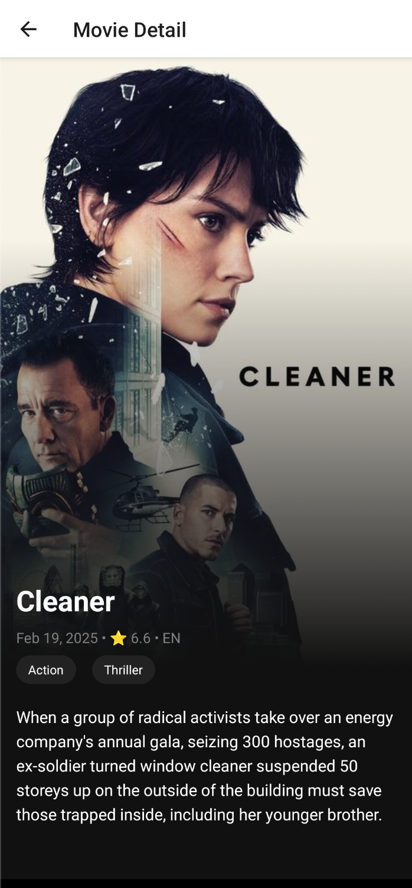

# Ocean of Movies

A sleek React Native app built with Expo that showcases the latest and greatest movies using the TMDB API.  
Features include categorized movie lists, detail views with elegant UI, and smooth navigation.

---

## Screens

### Home Screen
- Displays 4 horizontally scrollable sections:
  - **Featured**
  - **Top Rated**
  - **Now Playing**
  - **Upcoming**
- Each card shows poster, rating, title, and release date.
- "View All" buttons to see more in a grid layout.



### List of Movies
- Grid layout with 2 columns
- Paginated TMDB data
- Movies loaded based on selected category
- Custom movie card for compact display



### Detail Screen
- Large backdrop poster with gradient overlay
- Title, genres, release date, rating
- Overview description



---

## Features

- Expo with custom dev client
- React Navigation with Expo Router
- TanStack Query for API caching + pagination
- TMDB API integration
- Clean, dark UI
- Fully typed with TypeScript
- Environment variable support via `.env`

---

## 🧠 Tech Stack

- React Native (Expo)
- TypeScript
- Expo Router
- TanStack Query
- Axios
- TMDB API
- dotenv

---

## 🔐 Environment Setup

Create a `.env` file in the root:

```env
TMDB_API_KEY=your_tmdb_api_key_here
